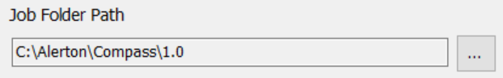

## Recipe

```
{}
```
Recipe is a JSON object.  The empty object above would do nothing.

**Properties**:
- Files 
- SQLTables 
- Folders
- FileLists
- PrepGlobals

**Files**, **SQLTables**, **Folders**, and **FileLists** all are Arrays of Objects
**PrepGlobals** is just an Object.

```json
{
  "Files": [],
  "SqlTables": [],
  "Folders": [],
  "FileLists": [],
  "PrepGlobals" : {}
}
```

Some properties of the following objects are related to file or folder paths.  Often, in those cases, data from the PmFileCollection form can be used as substitutions inside these paths.

Substitutions:
- install 

- rep 

- job 


As an example here's an example where the source path is using Substitution variables:
```
"Source": "[install]/[rep]/[job]/BACtalk.mdb"
```
Using the values seen in the form above, the resulting path would be "C:\Alerton\Compass\1.0\syserco\syserco\BACtalk.mdb"

Also, in all paths, the forward slash / and the backslash \ can generally be used interchangeably.  But remember that in JSON, double backslash \\ must be used to represent a backslash.

```json
"Source": "[install]/[rep]/[job]/BACtalk.mdb"
```
is equivalent to
```json
"Source": "[install]\\[rep]\\[job]\\BACtalk.mdb"
```


### Files 

Checks if a file exists and copies it to the zip file.

**Properties**:
- Source
	- Required
	- Data type: String
	- Path to file to copy.  
	- Substitutions apply 
- Destination
	- Data type: String
	- Path inside zip file that file will be copied to.
	- Default: If no value provided, file will be copied into the root of the zip file.
- ExpTime (Expiration Time)
	- Data type: String with TimeSpan formatting. \[[1]]
	- If Provided, compares how old the file is to value provided.  If older, provides warning text.
- CheckOnly
	- Data type: Bool
	- Default: false
	- If true, file is checked to see if it exists, and if exceeds any ExpTime provided.  But file is **not** copied to destination.


**Examples**:

```json
{
  "Source": "[install]/[rep]/[job]/BACtalk.mdb",
  "ExpTime": "30.00:00:00"
},
```
*BACtalk.mdb* is copied to the root of the zip file and if it has been longer than 30 days since it was updated, a warning is supplied.

```json
{
  "Source": "[install]/[rep]/[job]/Reports/Commissioning/AlarmRecipientConfigs/AlarmRecipientConfigs.mdb",
  "Destination": "Reports/AlarmHandlerConfigs/"
},
```
*AlarmRecipientConfigs.mdb* is copied into the zip at folder *Reports/AlarmHandlerConfigs*.  Any folders which do not yet exist inside the zip file are created.

```json
{
  "Source": "[install]/bactalk.ini",
  "CheckOnly": true
},
```
*bactalk.ini* is checked to see if it exists, and warning shown if it does not.  But *bactalk.ini* is not copied to zip.


### SqlTables

Queries MS Access or SQL Server tables and exports them to a CSV file in the root of the zip file.

If SQL Server is used, then connection details are used to talk to SQL Server.

**Properties:**
- Name
  - Data Type: String
  - Table name inside MS Access or SQL Server
- SqlServer
  - Data Type: Bool
  - If false, MS Access is used.
- Path
  - Data Type: String
  - Path to .mdb file.
  - Substitutions apply
  - Only used when SqlServer = false

**Examples:**

```json
{
  "Name": "tblAlarmHistoryRecord",
  "SqlServer": true
},
```
All data from table *tblAlarmHistoryRecord* is retrieved and saved at the root of the zip file as *tblAlarmHistoryRecord.csv*

```json
{
  "Name": "tblDevices",
  "SqlServer": false,
  "Path": "[install]\\[rep]\\[job]\\BACtalk.mdb"
},
```
All data from table *tblDevices* is retrieved from BACtalk.mdb and saved at the root of the zip file.

### Folders

**Properties:**
- Source
  - Required
  - Data Type: String
  - Path to directory to copy
  - Substitutions apply
- Destination
  - Data Type: String
  - Path to directory in zip to copy to.  If no value provided, copies to root.
- Include
  - Data Type: Array of String
  - List of files inside folder to copy.  wild card * apply. "*", means to copy all files. "*.txt" would copy all all text files.
- IncludeSubFolders
  - Data Type: Bool
  - Defaults to false
  - If true, recurses thru all sub folders.

**Examples:**

```json
{
  "Source": "[install]/[rep]/[job]",
  "Destination": "Dev",
  "Include": ["devconfig.dcf"],
  "IncludeSubFolders": true
}
```
Copies all devconfig.dcf files from all folders in the rep/job directory and places them under the Dev directory in the zip file.

```json
{
  "Source": "[install]/[rep]/[job]/Reports/Commissioning",
  "Destination": "Reports",
  "Include": ["*.mdb*"],
  "IncludeSubFolders": true
}
```
Copies all .mdb files from all folders under Reports/Commissioning and places them under the Reports directroy in the zip file.

```json
{
  "Source": "[install]/[rep]/[job]/ddc",
  "Destination": "ddc",
  "Include": ["*.vsd"]
}
```
Copies all .vsd files from ddc directory and places them in ddc directory in the zip file.  Sub-folders of ddc are **not** checked for .vsd files.

### FileList

Works similar to Folder, but instead of copying files, it creates a list of file names, or file paths, from a folder and possibly it's sub-folders.

**Properties:**
- Source
  - Required
  - Data Type: String
  - Path to directory to read file names/paths from.
  - Substitutions apply
- Destination
  - Data Type: String
  - Path to folder to put file in zip.  If no path provided, file placed in root of zip.
- Include
  - Data Type: Array of String
  - Allows for wildcard * to be used to find files.  * means all files.  *.mdb would be all mdb files.
  - This is an array, so a whole list of searches can be provided. Example:  ["\*.txt", "\*.mdb", "\*.ini"]
- IncludeSubFolders
  - Data Type: Bool
  - Defaults to false
  - If true recurses thru all sub-folders under Source folder.
- FileName
  - Data Type: String
  - Name of output file in zip.
- UseFullPath
  - Data Type: Bool
  - Defaults to false
  - If false, only file name provided.
  If true, full path provided.
  Note, if IncludeSubFolders = true, UseFullPath should probably be set to true, or there is a chance of duplicate file names being listed.
- Header
  - Data Type: String
  - 1st line of output in file.  If no Header provided, 1st line of output in file is data (file name or path).


**Examples:**

```json
{
  "Source": "[install]/[rep]/[job]/ddc",
  "FileName" : "ddcFiles.csv",
  "Destination": "other",
  "Include": ["*"],
  "Header": "DDC name"
}
```
Creates other/ddcFiles.csv in the zip file.  Then adds the header "DDC name" to the 1st line of the file and  then lists all files in the ddc folder.  

```json
{
  "Source": "[install]/[rep]/[job]",
  "FileName": "JobFiles.csv",
  "Include": ["*"],
  "IncludeSubFolders": true,
  "UseFullPath": true
}
```
Copys all the full file paths from the rep/job folder into JobFiles.csv in the root of the zip file.

### PrepGlobal
List of Alerton Globals are retrieved from either SQL Server or BACtalk.mdb. This list is used to check if devconfig.dcf files exist for those devices. Also, in Prep Global, these files are renamed, to allow the user to go into Compass and save updated files.

PrepGlobal is not an array of objects.  It is only 1 object.

**Properties:**
- SqlServer
  - Data Type: Bool
  - Default: false
  - If false, Path must be provided to a BACtalk.mdb file.
- Path
  - Data Type: String
  - Path to BACtalk.mdb file.
  - Substitutions apply.
- ExpTime
  - Data Type: String with TimeSpan formatting. \[[1]]
  - No implemented
- InstructionsPath
  - Data Type: String
  - path relative to the PmFileExecutable for a .rtf file.  This file is to provide additional instructions after all the files are renamed after pressing the Prep Globals button.  This file should be created in WordPad, not MS Word, due to possible version compatibility issues.
  - If blank, then ignored.

**Examples:**

```json
"PrepGlobals" : {
  "SqlServer": false,
  "Path": "[install]/[rep]/[job]/BACtalk.mdb",
  "InstructionsPath": "prepGlobalsInstructions.rtf"
}
```


[1]:https://docs.microsoft.com/en-us/dotnet/api/system.timespan?view=netframework-4.5.2
